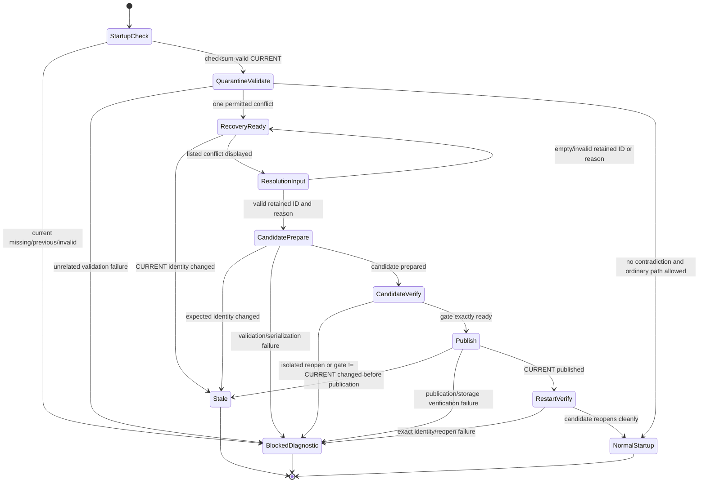

# Phase 4 Ownership Conflict Recovery Design

## 1. Purpose and Scope

This document defines the smallest safe architecture for recovering from a
checksum-valid committed generation whose ownership history contains individually
valid records but contradictory exact terminal records for one target.

The current committed behavior is intentionally fail-closed: normal isolated
graph reconstruction constructs the strict ownership record services, those
services reject the contradictory history, trusted startup returns
`status: blocked`, `persistenceMode: unavailable`, and
`reason: preparation_failed`, and Electron does not open the normal renderer.
The recovery surface described here is a future quarantined path. It is not an
ordinary startup fallback and it does not change the normal renderer or ordinary
persistence authority.

This is a Phase 4 recovery design only. It does not implement scoring, activate
Season 2, add backup/export, alter the notes/objectives boundary, or add generic
filesystem or Electron IPC capabilities to the domain.

## 2. Governing Constraints

The design follows these settled invariants:

- Authoritative ownership history is ownership records plus append-only
  retractions. The Server State Service map is derived projection only.
- A verified map blueprint is immutable operational reference data.
- Current state and projections must be rebuildable from authoritative history.
- Valid-but-contradictory ownership history is retained and flagged; it must not
  silently alter authority.
- Structurally invalid input, invalid chains, unknown references, and uncertain
  ownership history fail closed.
- Generation publication is the atomic authority boundary. `CURRENT` is never
  replaced before candidate verification succeeds.
- `PREVIOUS` preserves the prior committed generation after successful
  publication.
- Normal startup, `WarMapStartupReadiness`, and `StartupPersistenceGate` remain
  unchanged. `rebuildable_projection` and contradictory-generation recovery
  must never resume ordinary legacy writes.
- The Season Engine and domain services remain host-neutral. A recovery screen
  may be Electron-hosted, but it receives only the narrow recovery API.

Relevant Completion Plan consequences are Decisions 16-21, 30-32, 40-42,
49-50, 58-63. The Phase 4 Completion Plan remains open because Season 2
readiness, recovery acceptance, backup/restore, and the notes/objectives wording
are not all closed.

## 3. Current Boundary Evidence

The current production path is:

```text
GenerationStore.loadCommittedGeneration()
  -> current pointer and manifest checksum validation
  -> document checksum and JSON validation
  -> ownership provenance migration snapshot adapter
  -> isolated application graph loader
  -> ApplicationDocumentCodec.deserializeDocuments/applyState
  -> OwnershipRecordService construction
  -> OwnershipHistoryResolver
  -> startup migration decision/preparation/execution
  -> candidate verifier and ownership startup candidate gate
  -> GenerationStore.publish()
  -> WarMapStartupReadiness
  -> StartupPersistenceGate
  -> normal application bootstrap/renderer
```

The important failure occurs inside the isolated graph loader: strict ownership
history validation happens before the normal graph exists, so the existing
`MapOwnershipCoordinator.inspectOwnershipConflict()` method is unreachable.
That method is still useful for normal operation after a graph is healthy, but it
cannot be the quarantined entry point.

Existing components to preserve:

| Component | Keep / change boundary |
|---|---|
| `GenerationStore.loadCommittedGeneration()` | KEEP. It is the first checksum-valid current-generation boundary. |
| Committed-generation snapshot adapter | KEEP for normal migration; extend or add a quarantined adapter that returns the validated current snapshot without constructing the normal graph. |
| `ApplicationDocumentCodec` and isolated graph loader | KEEP for ordinary candidates and post-recovery reopen. Do not use them to admit the contradictory source graph. |
| Ownership record/retraction validators | KEEP as the individual-record and retraction validation kernels. |
| `OwnershipHistoryResolver` | KEEP as the authority for chain semantics; extract a shared analysis kernel rather than duplicating rules. |
| `MapOwnershipCoordinator.inspectOwnershipConflict()` | REFACTOR toward a pure conflict-analysis service reusable by normal and quarantined paths. It must not remain the only implementation of conflict derivation. |
| Migration decision/preparation/execution | KEEP for normal provenance migration; add a recovery-specific preparation/execution coordinator that uses the same candidate builder, verifier, gate, and publication boundary. |
| Startup readiness and persistence gate | KEEP unchanged. They continue to block the ordinary graph when recovery has not produced a verified generation. |
| Audit service and candidate publication | KEEP. Recovery writes an explicit audit record in the candidate and publishes only through verified generation publication. |

## 4. Proposed Components

### 4.1 `CurrentGenerationQuarantineSnapshotAdapter`

Responsibility:

- Call `GenerationStore.loadCommittedGeneration()`.
- Accept only `{ status: "committed", source: "current" }`.
- Reject `missing`, `previous`, fallback, recovery, malformed pointer, invalid
  manifest, checksum mismatch, and any ambiguous source.
- Return a safe copy containing the exact current identity, manifest, and all
  document values already verified by `GenerationStore`.
- Never call `ApplicationDocumentCodec.applyState()`.
- Never mutate `CURRENT`, `PREVIOUS`, source documents, or service state.

Input:

```js
{ expectedCurrent: { generation, manifestFile, manifestSha256 } | null }
```

Allowed fields are exactly `expectedCurrent`. For startup recovery the expected
identity is the identity observed immediately before the recovery screen opens;
it is never caller-authored from a form.

Output:

```js
{
  status: "loaded",
  source: "current",
  expectedCurrent: { generation, manifestFile, manifestSha256 },
  manifest,
  documents: [{ documentId, scope, type, value }],
  sourceDocumentIds: { strategic, projection }
}
```

The adapter must perform an identity re-read before every prepare and publish
attempt. A changed identity yields `stale_current`.

### 4.2 `QuarantinedDocumentValidator`

Responsibility:

- Validate the complete manifest/document identity and all non-ownership
  documents using existing versioned serializers and domain validators.
- Validate strategic envelope shape, schema version, season scope, state
  collection shapes, and ownership collection membership without constructing
  the strict ownership history service.
- Validate every ownership record individually using the existing territory and
  structure validators.
- Validate every retraction individually using the existing retraction
  validator.
- Validate union references, server/season scopes, target catalog references,
  event timestamp precision, evidence references, audit records, activity facts,
  snapshots, observations, and all non-ownership cross-document contracts.
- Produce a safe quarantined source snapshot; it must not produce a live runtime.

It may reuse the existing envelope deserializers where they do not instantiate
or cross-validate ownership history. If a current deserializer combines shape
validation with strict history construction, extract a pure envelope/record
validation step from it rather than bypassing validation.

It must reject:

- unsupported schema versions or unknown fields;
- any manifest/document scope or checksum mismatch;
- malformed JSON or missing required documents;
- unknown unions, servers, targets, structures, evidence IDs, or references;
- invalid timestamps, event windows, review metadata, or ownership states;
- proposed/rejected records being treated as authoritative;
- malformed supersession chains, cycles, cross-scope links, forks, or missing
  replacement records;
- malformed retraction chains, duplicate retractions, wrong-kind references,
  missing targets, or retractions of non-existent records;
- uncertainty, bounded/unknown terminal events, incomplete history, projection-
  only state, or any unrelated domain validation failure.

### 4.3 `OwnershipHistoryConflictAnalysis`

Responsibility:

- Be the single reusable ownership analysis kernel for normal inspection and
  quarantined recovery.
- Reuse the resolver's canonical target, supersession, retraction, exclusion,
  and terminal semantics. It must not implement a second resolver.
- Validate all records and chains, then classify exactly one permitted issue:
  multiple individually valid, confirmed, exact, non-superseded, non-retracted
  terminal records for the same scoped target.
- Return a deterministic conflict set derived from records and target catalog.
  Callers cannot provide record IDs, kind, target key, provenance, or projection
  values.

Output for one conflict:

```js
{
  status: "conflict",
  seasonId,
  serverId,
  kind: "territory" | "structure",
  target: {
    type: "normal_map_cell" | "strategic_node" | "logical_structure",
    row?, col?, nodeId?, structureId?
  },
  terminals: [
    {
      recordId,
      ownerUnionId,
      ownershipState: "owned" | "unclaimed",
      eventAt,
      reviewedAt,
      target
    }
  ]
}
```

The list is sorted by stable record ID. No projection is returned as an input to
recovery. A separate derived projection is calculated only after retractions are
selected and applied to a candidate history.

For all other states it returns one of `clear`, `malformed`, `uncertain`,
`incomplete`, `scope_mismatch`, or `unrepresentable`; none opens recovery UI.

Recommended extraction:

- Move shared target/index/chain analysis from `OwnershipHistoryResolver` into a
  host-neutral `OwnershipHistoryAnalysis` module.
- Keep `OwnershipHistoryResolver.resolve()` as the normal projection-facing
  adapter over that analysis.
- Have `MapOwnershipCoordinator.inspectOwnershipConflict()` call the same
  analysis for healthy live state.
- Have quarantined recovery call the analysis over validated source records.

This prevents normal and recovery paths from drifting in their interpretation of
supersession or retraction.

### 4.4 `QuarantinedOwnershipRecoveryService`

Responsibility:

- Expose only read conflict details and the one resolution command.
- Hold an immutable recovery session tied to one exact current generation
  identity and one conflict set.
- Re-read and revalidate the current generation before each command.
- Derive the rejected terminal IDs from the internally held conflict set.
- Append one manual retraction for every terminal except the selected retained
  record.
- Never delete or rewrite an ownership record.
- Never accept caller-provided retracted IDs, conflict kind, target, projection,
  or provenance.
- Never expose generic mutation, delete, filesystem, storage-adapter, or
  generation-store methods.

Factory input fields:

```js
{
  trustedActor,
  createTransactionId,
  createRetractionId,
  createAuditId,
  clock,
  validateOwnershipRetraction,
  validateOwnershipRetractionHistory,
  validateAuditRecord,
  validateAuditHistory,
  ownershipResolver,
  serializers: {
    serializeStrategicDomainEnvelope,
    serializeServerStateEnvelope,
    serializeApplicationAuditEnvelope
  }
}
```

The exact construction dependency is created in the main process. The current
desktop composition uses the existing trusted-local-actor convention with the
fixed configured local actor identity `desktop-user`:

```js
trustedActor: createTrustedLocalActor("desktop-user")
```

The recovery service validates that `trustedActor` is an immutable plain object
with exactly one non-empty `actorId` value; any trusted grant fields are
preserved but not operator-controlled. Renderer, preload,
recovery form, plan, and operator input cannot provide or override it. Invalid
actor output fails before any ID factory or clock is invoked.

`createTransactionId()`, `createRetractionId()`, and `createAuditId()` are
trusted main-process factories. They must return non-empty strings. The service
owns every invocation and rejects duplicate IDs: transaction IDs collide with
any existing audit transaction identity, retraction IDs collide with existing
retraction IDs and earlier IDs in the current batch, and audit IDs collide with
existing audit IDs. Operator input cannot provide any of these IDs.

`clock()` is a trusted main-process function returning a valid `Date`. The
service calls it exactly once per construction attempt and uses one
`toISOString()` UTC value for every new retraction and the audit record. Invalid,
non-Date, or throwing clock output fails closed. A failed unpublished attempt
may consume generated IDs and a timestamp; a retry obtains fresh values. The
higher-level execution coordinator owns already-resolved/current-generation
idempotency and must avoid invoking this service when no recovery is required.

The `serializers` object is required and exact. Its three functions are trusted
main-process composition adapters over the existing strategic-domain,
server-state, and application-audit serializer/validator contracts; they accept
already constructed in-memory envelope values and return validated document
values without storage access. No unknown factory fields are allowed.

Read API:

```js
getState() -> {
  status: "ready" | "blocked" | "stale" | "published",
  generation: { generation, manifestFile, manifestSha256 },
  seasonId,
  serverId,
  conflicts: [Conflict]
}
```

Command input fields are exactly:

```js
{ retainedRecordId, reason }
```

Those fields belong to the earlier recovery interaction that creates a validated
Slice 3A plan. Slice 3B receives only that validated plan and no additional
operator fields; it does not accept `retainedRecordId` or `reason` again.

The plan is the sole operator-derived input to document construction. It must
already bind the retained ID, reason, exact source generation, conflict kind,
target, and analyzer-derived terminal list. Transaction IDs, retraction IDs,
audit IDs, timestamps, actor identity, rejected IDs, projection, provenance,
scope, and generation metadata are never accepted from the operator.

For Slice 3B collision checks, the validated Slice 3A plan must also carry the
complete existing application-audit history as `existingAuditRecords`. This is
source state derived by the quarantine loader, not an operator field. If that
history is absent or unvalidated, construction is refused; the builder never
reads audit storage or calls an audit service to discover it.

### 4.5 Recovery document builder and candidate inputs

Responsibility:

The pure Slice 3B builder is
`createOwnershipConflictRecoveryDocumentBuilder({ trustedActor,
createTransactionId, createRetractionId, createAuditId, clock,
validateOwnershipRetraction, validateOwnershipRetractionHistory,
validateAuditRecord, validateAuditHistory, ownershipResolver,
serializers })`. It accepts only a validated Slice 3A recovery
plan. It performs no filesystem or generation-store calls and returns the
deterministic value/reference input shape consumed by the later preparation
slice.

After revalidating the plan, its exact source-generation binding, document
metadata, complete histories, conflict fingerprint, retained ID, and rejected
IDs, the builder re-runs the shared analyzer over the complete carried history
and requires byte/value-equivalent conflict identity. Then it calls trusted
dependencies in this exact order:

1. Validate the immutable trusted actor.
2. Call `clock()` exactly once and normalize one canonical UTC `recordedAt`.
3. Call `createTransactionId()` exactly once and reject existing audit
  transaction collisions.
4. Call `createRetractionId()` once per canonically sorted rejected record ID,
  rejecting empty or colliding results.
5. Construct and validate all append-only retractions and the complete
  post-retraction history.
6. Rebuild and validate the projection solely through the existing resolver,
  requiring the retained record to be the sole effective exact terminal.
7. Call `createAuditId()` exactly once.
8. Construct the `ownership_conflict_resolved` audit record, validate it with
  `validateAuditRecord`, append it to a cloned audit history, and validate the
  complete history with `validateAuditHistory`.
9. Serialize only the genuinely changed documents and return frozen candidate
  document inputs.

The builder creates each retraction record; the existing retraction validator
and history validator are its only retraction-shape authorities. The builder
creates the audit record in memory; the existing audit validators are its only
audit-history authorities. It never calls or mutates `ApplicationAuditRecordService`.

The audit record uses `trustedActor.actorId`, the single clock result, the one
transaction ID, the one audit ID, and the plan-bound conflict/source fields. The
complete audit history is `existingAuditRecords` plus that new record, validated
before the changed application-audit document is returned.

The returned candidate inputs copy every authoritative document unchanged except:

- append retractions to the strategic ownership-retraction collection;
- replace the server-state document with the projection rebuilt from the
  post-retraction authoritative history;
- append one complete `ownership_conflict_resolved` audit record.

4. Preserve all source document identities and checksums as references where
   allowed; changed documents become candidate-owned values.
5. Create a candidate with `expectedCurrent` equal to the exact observed current
   identity.

The projection builder must call the shared ownership analysis/resolver over the
post-retraction records. It must not patch a map key from the retained record or
copy a caller-supplied projection.

Existing ownership records and retractions retain their original values and
ordering. Unrelated documents and optional provenance remain exact source
references. The pure builder creates no durable record, pointer, candidate file,
timestamp outside its one injected clock read, or persistent side effect.

### 4.6 Normal candidate verifier and startup gate

The candidate must be reopened by the ordinary isolated graph loader after it is
prepared. This is the first point at which strict ownership history should pass,
because the rejected terminals are now represented by append-only retractions.

The verifier must:

- load candidate documents through `ApplicationDocumentCodec` and the isolated
  graph loader;
- verify all source references and candidate-owned document checksums;
- invoke `OwnershipStartupCandidateGate.evaluate()`;
- accept only an exact `decision: "ready"` result;
- reject `repair_required`, `recovery_required`, `ready_empty`, malformed, or
  any other decision for this recovery operation.

The existing `GenerationStore.publish(candidate, verify)` boundary remains the
only publication path. It rechecks candidate checksums, runs verification, checks
that the candidate did not change, and compares the current identity before
writing `PREVIOUS` and `CURRENT`.

## 5. Trust and Authority Boundaries

### Trusted inputs

- `GenerationStore`'s current pointer, manifest, and document checksums.
- Versioned season package and immutable target catalog.
- Global union registry loaded through its existing authoritative source.
- Existing validator and resolver semantics.
- The locally trusted actor supplied by the application host, not by recovery UI.

### Untrusted inputs

- All ownership records, retractions, projections, audit details, and other
  document values from the committed generation, even when checksums are valid.
- Recovery-screen retained ID and reason.
- Any renderer or IPC payload.
- Any claimed provenance, target, conflict kind, projection, transaction ID, or
  timestamp.

### Authority rules

- Checksums prove document integrity relative to the committed generation; they
  do not prove semantic correctness.
- Ownership records and retractions remain authoritative history.
- The legacy/committed Server State Service projection is never used to select a
  conflict or establish provenance.
- The recovery service derives all conflict and rejected IDs internally.
- The source generation is immutable. Candidate preparation is the only place
  where recovery facts are assembled.
- The new generation becomes authoritative only after normal verified
  publication.

Slice 3B trusted construction authority is main-process-only. The current
desktop composition creates `trustedActor` through the existing convention as
`createTrustedLocalActor("desktop-user")`. The builder validates exactly one
non-empty `actorId`; renderer, preload, plan, and operator input cannot supply or
override it.

`createTransactionId()`, `createRetractionId()`, and `createAuditId()` are
injected main-process factories owned and invoked by the builder. Each must
return a non-empty string. Transaction IDs must not collide with any transaction
ID in carried audit history. Retraction IDs must not collide with carried
retraction IDs or earlier IDs generated in the same canonical rejected-ID batch.
Audit IDs must not collide with carried audit IDs. Empty, duplicate, or throwing
factory output fails closed. Operator input cannot provide any generated ID.

`clock()` is an injected main-process function returning a valid `Date`. The
builder calls it exactly once per construction attempt after plan validation and
uses its single `toISOString()` value for every new retraction and the audit
record. Invalid, non-Date, or throwing output fails closed. Failed unpublished
attempts may consume IDs or timestamps; retries obtain fresh values. A higher
level execution coordinator owns already-resolved idempotency and skips builder
invocation when no recovery is required.

## 6. State Machine



`RecoveryReady` is not a normal application persistence mode. The persistence
gate remains closed to ordinary legacy and generation writes until publication
has completed and trusted startup restarts against the new generation.

## 7. Input and Output Contracts

### Recovery session creation

Input is internal startup context only:

```js
{
  expectedCurrent: { generation, manifestFile, manifestSha256 },
  seasonId,
  serverId
}
```

The session must reject missing, previous, fallback, or mismatched generation
identity. It must not accept a caller-selected server outside the validated
active/completed season scope.

Output is either:

- `recovery_ready` with deterministic conflict details; or
- a blocked diagnostic with no recovery capability.

Slice 3B receives exactly one validated Slice 3A recovery plan. The retained
record ID and reason are already inside that plan; the document builder accepts
no additional operator fields.

### Resolution result

```js
{
  status: "prepared" | "published" | "already_published" | "stale" | "blocked",
  generation?: { generation, manifestFile, manifestSha256 },
  retractedRecordIds?: string[],
  retainedRecordId?: string,
  diagnostics?: string[]
}
```

Returned IDs are safe copies derived from the validated conflict. The UI never
receives low-level storage paths, file handles, generation-store methods, or
service references.

### Audit record

The candidate must contain one `ownership_conflict_resolved` record with:

- `actionType`: `ownership_conflict_resolved`;
- `targetType`: `ownership_record`;
- deterministic conflict target ID;
- season and server scope;
- trusted local actor ID;
- coordinator-generated transaction ID;
- recorded timestamp from the injected application clock;
- details containing retained record ID, sorted retracted record IDs, target kind,
  target identity, and bounded resolution reason.

The individual append-only retraction records use the same transaction ID and
trusted actor, and contain their own retraction IDs, recorded timestamps, target
kind, and retracted record IDs.

The pure builder obtains the audit ID from `createAuditId()` only after all
retractions and the resolver-derived projection validate successfully. It builds
the audit record in memory, validates it with `validateAuditRecord`, appends it
to a cloned history, and validates the complete history with
`validateAuditHistory`. It does not call or mutate `ApplicationAuditRecordService`.

## 8. Failure Classifications and User Outcomes

| Classification | Trigger | Outcome |
|---|---|---|
| `unsafe_committed_generation` | `CURRENT` missing, previous/fallback source, or recovery result | No recovery screen; deterministic blocked startup. |
| `checksum_invalid` | Pointer, manifest, or document checksum mismatch | No recovery; preserve files and require storage recovery. |
| `scope_mismatch` | Season/server/base-map/document scope mismatch | No recovery; no writes. |
| `schema_invalid` | Unsupported version, unknown field, malformed envelope | No recovery; preserve source. |
| `ownership_record_invalid` | Individual record invalid | No recovery; contradiction is not an excuse to bypass validation. |
| `ownership_chain_invalid` | Supersession/retraction missing reference, cycle, fork, wrong kind, or cross-scope link | No recovery. |
| `ownership_uncertain` | Bounded/unknown effective terminal or incomplete history | No recovery; uncertainty is not a conflict resolution choice. |
| `ownership_unrelated_conflict` | Conflict outside the narrow exact-terminal case | No recovery; deterministic diagnostic. |
| `conflict_not_found` | No internally derived conflict at command time | Stale session; no candidate. |
| `invalid_retained_record` | Caller selects ID not in derived conflict list | Stay in recovery screen with validation error; no writes. |
| `invalid_reason` | Empty or overlong reason | Stay in recovery screen; no writes. |
| `stale_current` | Current identity changes at any read/prepare/verify/publish point | Close session; preserve old and concurrent generations. |
| `candidate_verification_failed` | Isolated reopen or gate result is not exactly `ready` | No publication; candidate remains non-authoritative. |
| `publication_failed` | Atomic pointer/document publication fails | Preserve prior `CURRENT` and `PREVIOUS` according to GenerationStore result; show blocked recovery diagnostic. |
| `restart_identity_failed` | Published candidate cannot reopen as exact current | Block startup; do not open ordinary writes. |

No failure path deletes an ownership record, rewrites the source generation, or
falls back to ordinary legacy writes.

## 9. Transaction, Audit, Rollback, and Concurrency Semantics

Recovery is a candidate transaction, not an in-place repair:

1. Capture exact current identity and source documents.
2. Validate and analyze the source in quarantine.
3. Collect retained ID and reason through the narrow recovery surface.
4. Re-read the exact current identity.
5. Append retractions to a candidate copy for every rejected terminal.
6. Rebuild projection from candidate authoritative history.
7. Append audit record with coordinator-generated transaction ID.
8. Prepare candidate documents through `GenerationStore.prepare()`.
9. Reopen candidate in the normal isolated graph loader.
10. Require candidate gate `decision === "ready"`.
11. Publish through `GenerationStore.publish()`.
12. Re-read `CURRENT` and restart normal startup against the published identity.

Slice 3B is only the in-memory portion between source validation and later
candidate preparation. After pure plan validation and exact conflict reanalysis,
its trusted call order is:

1. validate `trustedActor`;
2. read `clock()` once;
3. call `createTransactionId()` once and check audit-history collisions;
4. call `createRetractionId()` once per canonically sorted rejected ID;
5. construct and validate retractions and post-retraction history;
6. rebuild and validate projection through the existing resolver;
7. call `createAuditId()` once;
8. construct and validate the audit record and cloned audit history; and
9. serialize changed documents and return frozen candidate inputs.

It does not invoke `GenerationStore.prepare()`, `publish()`, or `commit()` and
does not write files, pointers, candidates, or live service state.

The application mutation coordinator is not used to mutate the source generation
because recovery must not make partial changes to the blocked live graph. The
candidate document builder and GenerationStore provide the transaction boundary.
If audit construction, candidate preparation, isolated verification, or
publication fails, the source documents and current pointer remain unchanged.
Successful publication writes the old current pointer to `PREVIOUS` before
installing the new `CURRENT` pointer. A later restart can therefore inspect the
prior generation without losing the pre-recovery state.

Concurrent behavior:

- A second recovery session may inspect the same identity, but only the first
  successful publication wins.
- Any later prepare or publish operation whose expected identity no longer matches
  returns `stale_current`.
- If the same candidate is retried after publication, GenerationStore returns
  `already_published`; restart verification must still pass.
- A failed unpublished Slice 3B attempt may consume its generated IDs and
  timestamp. A retry uses fresh factory results. The later execution coordinator
  first reloads the exact current generation and skips construction when the
  conflict is already resolved or published.
- A changed source document, conflict set, retained choice, or audit reason
  requires a new candidate identity and cannot be silently merged.

## 10. Territory and Structure Separation

Territory and structure conflicts remain separate domains:

- Territory records use `ownershipRecordId`, territory target identity, and
  `territory_ownership_record` retractions.
- Structure records use `structureOwnershipId`, logical structure identity, and
  `structure_ownership_record` retractions.
- A territory conflict cannot be resolved by a structure record and vice versa.
- Structure projection rebuild applies structure ownership over its footprint,
  while preserving resolved underlying territory facts and leaving cells without
  an underlying fact absent.
- The conflict target catalog and analysis must reject a structure footprint or
  territory target that is unknown or out of scope.
- A candidate containing both conflict kinds must expose one deterministic
  conflict at a time or refuse recovery; it must never let a territory choice
  authorize a structure mutation.

## 11. Archived-Season Handling

Archived history is readable but not operationally mutable. If the conflicting
generation belongs to a completed/archived season:

- recovery startup may expose a read-only diagnostic showing the conflict and
  source generation identity;
- the retained-record selector, reason input, and resolve command are disabled;
- no retractions, audit record, candidate, or publication may be created;
- the normal archived historical viewer remains read-only after a healthy
  generation is available.

If an archived conflict prevents a generation from opening, the recovery result
must remain blocked with a deterministic diagnostic and direct the operator to an
explicit offline/administrative recovery process. It must not silently reopen the
season or treat it as active.

## 12. Minimal Recovery Screen and Host Boundary

The recovery screen is a dedicated, minimal startup surface, not the normal
renderer. It may display:

- season, server, generation identity, and a clear blocked-startup message;
- target kind and identity;
- every internally derived terminal record with record ID, owner, exact event
  time, and review time;
- a select-one retained record control;
- a required bounded reason field;
- Resolve and restart controls, disabled for archived history;
- deterministic failure and stale-head messages.

Its preload API contains only:

```js
{
  getRecoveryState(): Promise<RecoveryState>,
  resolveConflict(input: { retainedRecordId, reason }): Promise<RecoveryResult>,
  restartAfterRecovery(): Promise<RestartResult>
}
```

The API must reject unknown fields and never expose `ipcRenderer`, filesystem
paths, storage identities, generation-store objects, generic mutation methods,
or ordinary persistence writes. The main process owns the recovery session and
trusted actor. The renderer cannot choose actor, transaction, timestamps,
provenance, conflict kind, target, rejected IDs, or projection values.

A dedicated recovery window may be introduced only for the blocked result. The
normal `BrowserWindow` bootstrap remains closed until a verified generation
reopens successfully.

## 13. Behavior and Integration Tests

All tests use a disposable real filesystem and injected deterministic clocks.
No test edits a normal user profile or canonical map data.

### Source and analysis tests

1. A valid exact territory conflict is derived from two terminal records; the
   caller supplies only the reason and retained ID from the displayed list.
2. A structure conflict is derived separately and produces structure retraction
   target kinds.
3. Proposed, rejected, superseded, or already-retracted records are excluded from
   the conflict set.
4. Malformed records, invalid timestamps, unknown unions/targets, bad scopes,
   missing references, cycles, forks, and wrong-kind retractions are refused.
5. Bounded or unknown terminal time, partial history, projection-only state, and
   unrelated domain errors are refused.
6. A caller-supplied conflict kind, record list, provenance, projection,
   transaction ID, actor, or timestamp is rejected.

### Real-filesystem generation tests

7. A checksum-valid current generation containing a narrow exact contradiction is
   quarantined without opening the normal graph.
8. A checksum-valid generation with a non-ownership validation failure is refused
   without recovery UI.
9. A selected terminal produces append-only retractions for every other derived
   terminal; no ownership record is deleted or rewritten.
10. Candidate projection equals the post-retraction resolver output, including
    unclaimed and absent-key distinctions and structure footprint precedence.
11. The candidate audit record has the retained ID, sorted rejected IDs, reason,
    actor, transaction, season, and server.
12. Candidate isolated reopen succeeds and the startup candidate gate returns
    exactly `ready`; `repair_required` and `recovery_required` do not publish.
13. Candidate or publication failure leaves source documents, `CURRENT`, and
    `PREVIOUS` unchanged.
14. A concurrent head change returns `stale_current` and leaves both candidates
    non-authoritative.
15. Repeating a successful resolution is deterministic and returns
    `already_published` or a clear no-conflict result without duplicate retractions
    or audit records.
16. Restart after publication opens the normal renderer and the prior generation
    remains readable through `PREVIOUS`.
17. Archived conflicts expose read-only diagnostics and reject resolution.
18. The normal first-run, aligned legacy, rebuildable legacy, fallback/recovery,
    already-proven, and clean generation startup tests remain unchanged.

### Slice 3B construction tests

19. Forged actor, transaction, retraction ID, audit ID, timestamp, rejected ID,
  projection, provenance, or audit fields are rejected; only the validated plan
  and trusted construction dependencies are accepted.
20. Invalid trusted actor output, empty or duplicate transaction/retraction/audit
  IDs, collisions with carried audit/retraction history, invalid clock output,
  and factory exceptions fail closed before partial output is returned.
21. `createRetractionId()` is called exactly once per canonical rejected ID in
  sorted order, `clock()` is called exactly once, and transaction/audit factories
  are called only at their specified points.
22. Failed unpublished attempts may consume IDs; retries obtain fresh values, and
  an already-resolved retry invokes no builder factories.
23. Territory and structure construction preserve underlying territory/footprint
  projection semantics, existing history order, existing audit history, exact
  unrelated-document references, and optional provenance references.
24. Serializer, validator, resolver, projection, fingerprint, and source-generation
  binding failures return no candidate inputs and perform no writes.
25. Missing or malformed `existingAuditRecords` is refused; transaction and audit
  collision checks use only that validated carried history.

### Electron walkthrough

- Seed one disposable profile using real serializers and GenerationStore.
- Launch and assert the dedicated recovery surface, not the normal renderer.
- Resolve a territory conflict, close the window, restart, and inspect the
  reopened history/projection/audit through a test-only diagnostic adapter.
- Repeat with a structure conflict in a separate disposable profile.
- Confirm archived conflict state shows no enabled mutation controls.
- Remove only the disposable profiles after evidence capture.

## 14. Explicit Exclusions

This architecture does not include:

- ordinary startup acceptance of contradictory history;
- weakening `LegacyStateClassifier`, `WarMapStartupReadiness`,
  `StartupPersistenceGate`, validators, or generation checksum/pointer checks;
- deleting, rewriting, or silently repairing ownership history;
- generic migration bypass or legacy write resumption;
- arbitrary domain mutation, correction, proposal review, or evidence editing from
  the recovery surface;
- scoring, score caches, Season 2 activation, Season 2 rule research, or
  reconciliation;
- backup/export/import, cleanup, blob deletion, or maintenance jobs;
- objectives, priorities, recommendations, or a new notes model;
- normal renderer redesign or access to ordinary Data Management workflows;
- Electron IPC beyond the narrow recovery preload API;
- hosted collaboration, authentication, roles, or multi-user conflict handling.

## 15. Dependency-Ordered Implementation Slices

### Slice 0: Freeze the recovery contract

- Add strict contract types/field sets and deterministic failure codes.
- Add the recovery state machine and actor/transaction ownership rules.
- Add behavior tests for caller untrustedness and archived read-only behavior.

### Slice 1: Extract shared ownership analysis

- Extract the resolver's target/index/chain/terminal analysis into a pure host-
  neutral module.
- Adapt `OwnershipHistoryResolver` and normal `MapOwnershipCoordinator` to use
  it without behavior change.
- Add territory/structure conflict analysis tests and verify all existing normal
  resolver tests remain equivalent.

### Slice 2: Quarantined source validation

- Add current-generation quarantine snapshot adapter.
- Add pure document validator that validates all non-ownership domains normally
  and every ownership record/retraction individually.
- Permit exactly the narrow terminal contradiction; reject every other issue.
- Add real-filesystem blocked-startup and malformed-source tests.

### Slice 3: Candidate recovery transaction

- **3A:** build and validate the pure recovery plan from quarantined conflict data.
- **3B:** construct changed document/reference inputs in memory using
  `createOwnershipConflictRecoveryDocumentBuilder` and the exact trusted actor,
  ID factories, clock, validators, serializers, and resolver contract above.
  The Slice 3A plan carries validated `existingAuditRecords` for collision checks.
- **3C:** add quarantined recovery execution/session ownership, candidate
  preparation, isolated verification, and publication through the existing
  generation boundary.

### Slice 4: Minimal Electron recovery surface

- Add a dedicated blocked-startup window and narrow preload API.
- Display deterministic conflict details and validation failures.
- Keep ordinary renderer and persistence gate closed until verified publication.
- Add disposable-profile territory/structure recovery walkthroughs.

### Slice 5: Restart and archived behavior

- Reopen the published candidate through the normal graph loader.
- Verify `CURRENT`/`PREVIOUS`, idempotent retry, stale concurrent head, and
  archived read-only behavior.
- Update Phase 4 report and handoff with actual runtime evidence.

## 16. Smallest Coherent First Implementation Slice

The smallest coherent slice is **Slice 1 plus the read-only part of Slice 2**:

1. Extract shared ownership analysis without changing normal resolver behavior.
2. Add a quarantine-only current-generation snapshot adapter that accepts only
   checksum-valid `CURRENT` and exact identity.
3. Add a pure conflict classifier that validates records/retractions individually,
   derives one narrow exact terminal conflict, and rejects all other states.
4. Add real-filesystem tests proving contradictory generations remain blocked and
   normal startup/readiness/gate behavior is unchanged.

Do not add a UI, candidate mutation, or new publication path in this first slice.
This keeps the first change auditable and establishes the authority boundary
before any recovery write capability exists.

## 17. Definition of Done

The design is ready for implementation only when:

- the normal renderer never opens on contradictory source history;
- only checksum-valid current generations enter quarantine;
- every record/retraction and every non-ownership domain is validated;
- only the narrow exact terminal contradiction is recoverable;
- conflict details and rejected IDs are derived internally;
- territory and structure recovery remain distinct;
- the source generation remains immutable;
- candidate projection is rebuilt from post-retraction authoritative history;
- audit and retractions share one coordinator-generated transaction ID;
- candidate isolated reopen succeeds and the ownership candidate gate returns
  exactly `ready`;
- publication preserves `PREVIOUS` and rejects stale heads;
- successful restart is idempotent and the prior generation remains readable;
- archived conflicts remain read-only;
- the minimal recovery surface exposes no generic persistence or filesystem
  capability;
- all behavior and real-filesystem tests in Section 13 pass;
- Phase 4 documentation reports actual evidence and does not mark Phase 4
  complete until the remaining release work is closed.

## 18. Unresolved Engineering Questions

The Slice 3B trusted authority contract is settled. Main-process composition
supplies immutable `trustedActor`, `createTransactionId`, `createRetractionId`,
`createAuditId`, and `clock`, plus the existing validators, resolver, and
serializers. No renderer or operator authority is required for construction.

- Can the current document validators be cleanly separated from service
  construction without weakening any existing constructor validation? If not,
  quarantine must use a new pure validation layer with tests proving identical
  record semantics.
- Should the recovery window be implemented as a dedicated HTML document or as a
  main-process-owned native diagnostic surface? The decision must preserve the
  narrow preload contract and must not reuse the normal renderer bootstrap.
- How should an archived conflict be handed off to an operator once read-only
  diagnostics are shown? The handoff must remain offline/administrative and must
  not silently reactivate the archived season.
- What exact durable diagnostic should be shown when a candidate's post-
  publication visibility check fails after `CURRENT` may have changed? The
  existing GenerationStore recovery semantics remain authoritative; the recovery
  screen must not guess which generation won.
